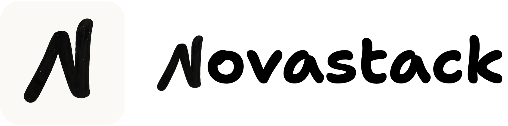

<div align="center">
  
</div>

<div align="center">
  <h3>Forge data pipelines, unleash smart AI applications.</h3>
</div>

<div align="center">
  
  
    
  <a href="https://pepy.tech/projects/novastack"></a>
  
</div>

## Installation 

```bash
pip install novastack
# or
uv add novastack
```

## License

[Apache License 2.0](LICENSE)
